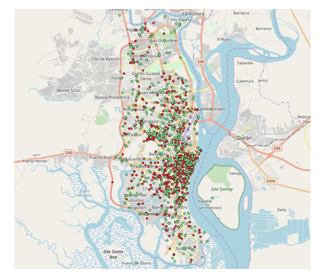
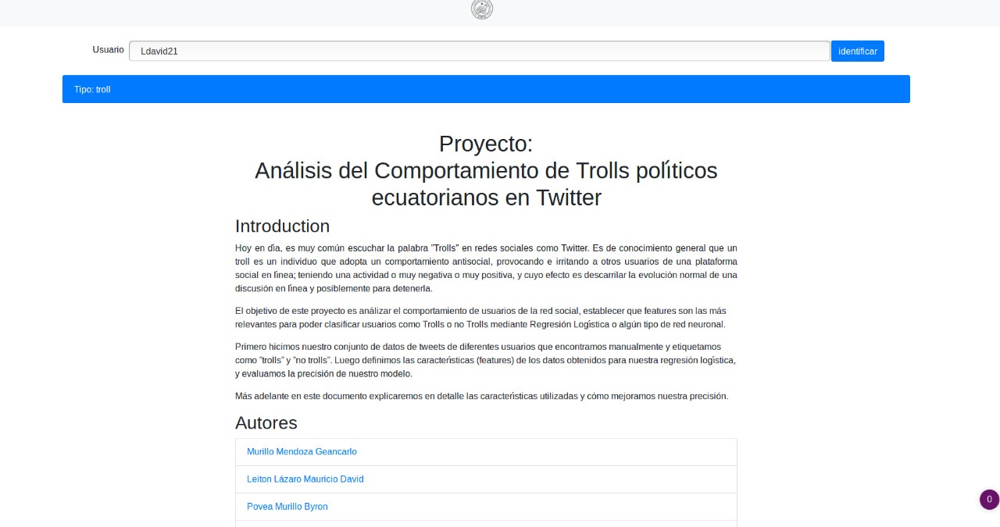
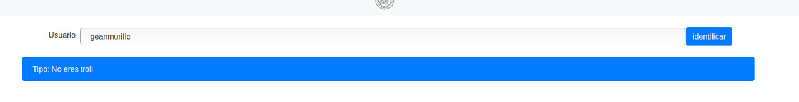
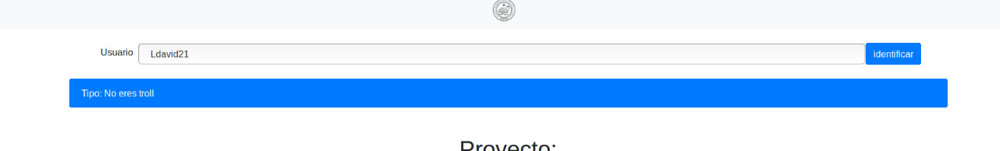
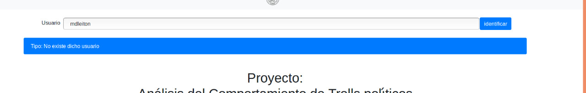

# AED
Repositorio del proyecto de la materia de Análisis exploratorio de datos

Primer parcial
--------------
# Análisis del crecimiento comercial de Guayaquil

1. Descripción

Determinar el avance/crecimiento comercial de Guayaquil en base a la cantidad de locales comerciales tanto activos como inactivos que existen registrados en el SRI(1,8 millones al 8-junio-2019).
Identificar patrones de expansión de acuerdo a la ubicación de los locales que posee cada contribuyente al SRI. Y con la información del estado del local comercial determinar patrones de expansión “exitosos” y no “exitosos”.

2. Resultados

* La mayor cantidad de locales que se crearon y se suspendieron fueron en los periodos presidenciales de Rafael Correa.
* A partir del año 2007 se implementaron nuevas reglas y reformas a la ley para un mejor control de los contribuyentes.
* Existe un mayor porcentaje de nuevos contribuyentes en los meses de Enero y Abril.
* Rocafuerte, Carbo y Tarqui son las parroquias que tienen la mayor cantidad de nuevos locales abiertos en los últimos 20 años.
* Rocafuerte, Carbo y Tarqui son las parroquias con mayor frecuencia de éxito.

3. Geolocalización de locales

	

Segundo parcial
---------------

# Análisis del Comportamiento de Trolls polı́ticos ecuatorianos en Twitter para poder identificarlos

1. Descripción

Hoy en dı́a, es muy común escuchar la palabra ”Trolls” en redes sociales como Twitter. Es de conocimiento general
que un troll es un individuo que adopta un comportamiento antisocial, provocando e irritando a otros usuarios de una
plataforma social en lı́nea; teniendo una actividad o muy negativa o muy positiva, y cuyo efecto es descarrilar la
evolución normal de una discusión en lı́nea y posiblemente para detenerla. El objetivo de este proyecto es análizar el
comportamiento de usuarios de la red social, establecer que features son las más relevantes para poder clasificar usuarios
como Trolls o no Trolls mediante Regresión Logı́stica o algún tipo de red neuronal. Primero hicimos nuestro conjunto
de datos de tweets de diferentes usuarios que encontramos manualmente y etiquetamos como ”trolls” y ”no trolls”. Luego
definimos las caracterı́sticas (features) de los datos obtenidos para nuestra regresión logı́stica, y evaluamos la precisión de
nuestro modelo. Más adelante en este documento explicaremos en detalle las caracterı́sticas utilizadas y cómo mejoramos
nuestra precisión.

2. Resultados

* Se identificaron características que distinguen usuarios troll y no troll.
* La precisión es buena para la regresión logística, 85.7% para el conjunto de datos de entrenamiento y 84.09% para probar el conjunto de datos.
* La precisión para la red LSTM es mejor 97.7% para el conjunto de datos de entrenamiento y 87.57% para probar el conjunto de datos.
* Es necesario realizar un análisis de los componentes principales para determinar  cuál características y cuál combinación de ellas es la más adecuada y que permita mejorar nuestra precisión de clasificación.
* Se aplicaron algoritmos de aprendizaje no supervisado como k means y svm para clasificar pero no fueron exitosos.

3. Demo
Aplicación web donde se puede ingresar el nombre del usuario de twitter. Luego se retorna un mensaje si eres troll o no.

	
	
	
	

### Autores ###
* Murillo Mendoza Geancarlo [github](https://github.com/gcmurillo)
* Leiton Lázaro Mauricio David [github](https://github.com/mdleiton)
* Povea Murillo Byron [github](https://github.com/bpovea)
* Saigua Labre Daniel [github](https://github.com/dfsaigua)

### Referencia ###

* Clasificador de troll [github](https://github.com/gcmurillo/trolls_clasificator)